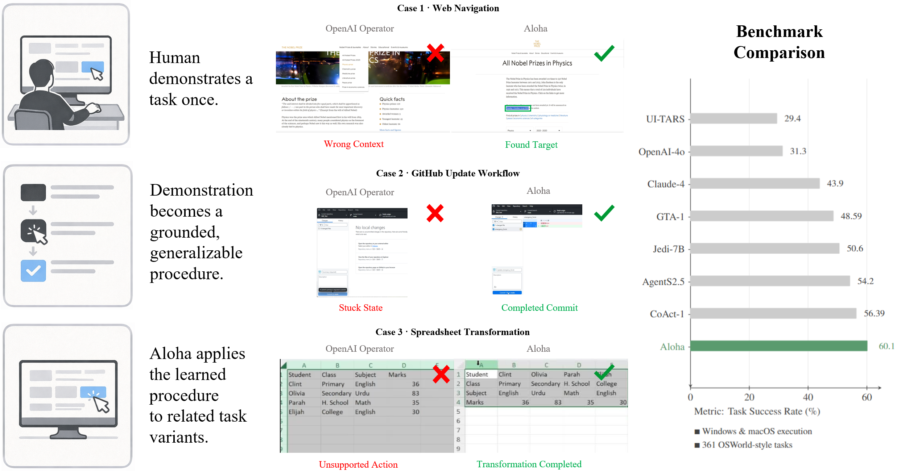
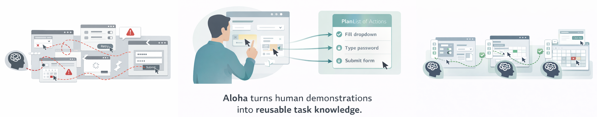
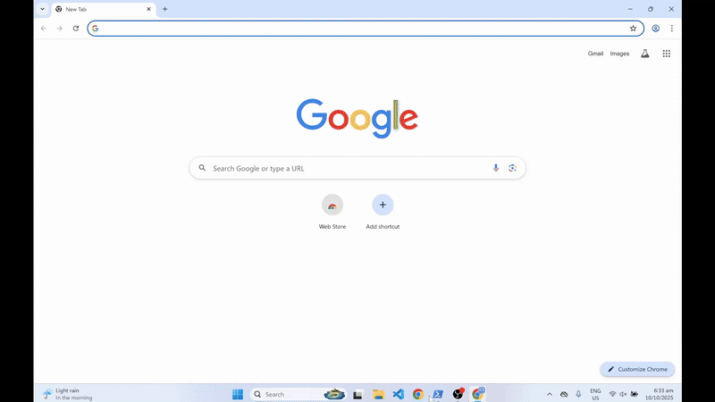
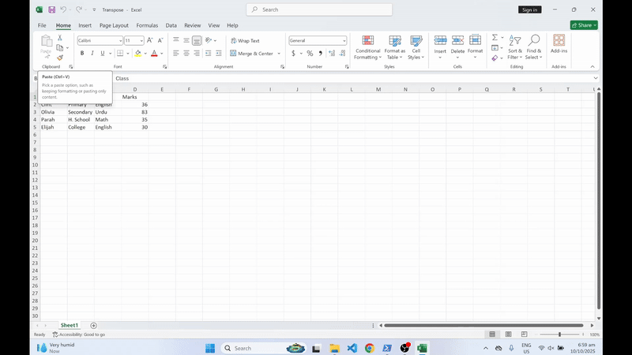
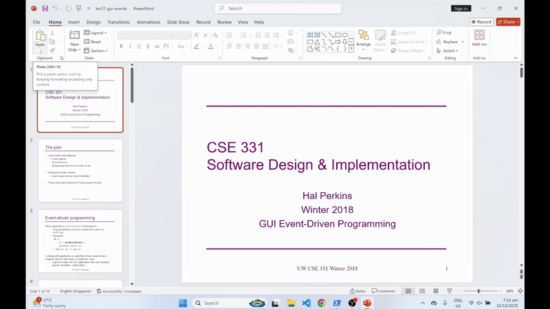
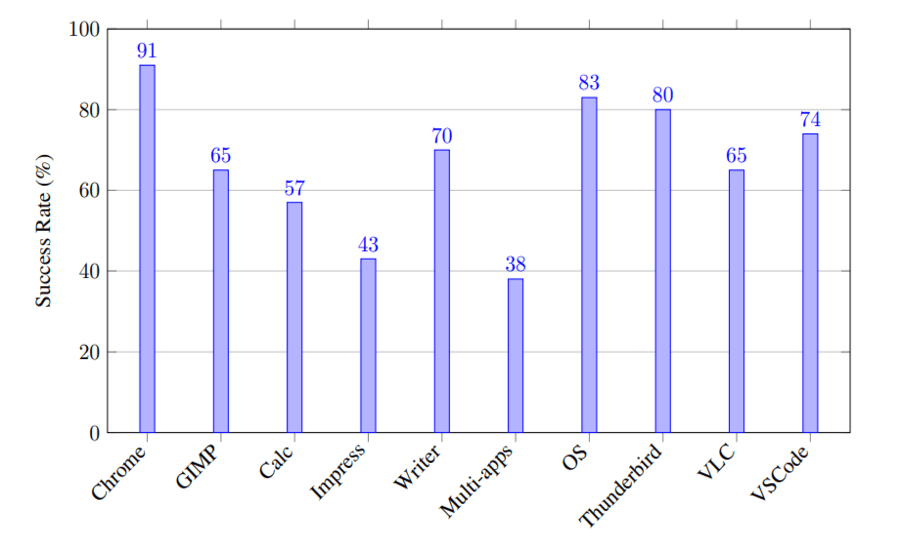
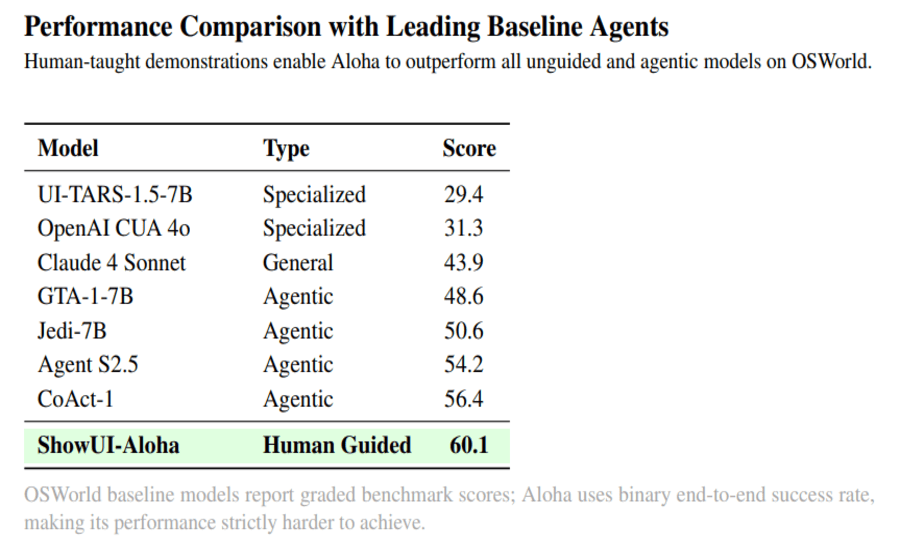

<p align="center">
  
</p>

<h1 align="center">ShowUI-Aloha — Human-Taught Computer-Use Agent</h1>

<p align="center">
Teach your computer once. Aloha learns the workflow and executes new task variants.<br>
<strong>Recorder → Learner → Planner → Actor → Executor</strong>
</p>

<p align="center">
  
  
  
  
</p>

---

## 🌟 What is ShowUI-Aloha?

**ShowUI-Aloha** is a human-taught computer-use agent designed for real Windows and macOS desktops.

Aloha:

- Records human demonstrations (screen + mouse + keyboard)
- Learns semantic action traces from those demonstrations
- Plans new tasks based on the learned workflow
- Executes reliably with OS-level clicks, drags, typing, scrolling, and hotkeys

Aloha learns through **abstraction, not memorization**: one demonstration generalizes to an entire task family.

<p align="center">
  
</p>

---

## 💼 Why This Matters

- Evaluated on all 361 OSWorld-Style tasks  
- 217 tasks solved end-to-end (strict binary metric)  
- Works on Windows and macOS  
- Modular: Recorder / Learner / Actor / Executor  
- Fully open-source and extensible  

---

## 🎬 Demo Gallery

<p align="center">
<table>
<tr>
<td align="center">
  
  <br><b>Air-ticket booking</b>
</td>
<td align="center">
  
  <br><b>Excel: matrix transpose</b>
</td>
<td align="center">
  
  <br><b>PowerPoint batch background editing</b>
</td>
</tr>
</table>
</p>

<p align="center">
  
  <br><b>Github Reposit Editing</b>
</p>

---

## 📈 OSWorld Benchmark Snapshot

<p align="center">
  
</p>

<p align="center">
  
</p>

---

## 🧩 Architecture Overview

<p align="center">
  
</p>

---

## ⚙️ Installation & Setup

### Requirements

- Windows 10+ or macOS  
- Python 3.10+  
- At least one VLM API key (OpenAI / Claude)

---

### 1. Clone the repository

git clone https://github.com/
cd aloha

---

### 2. Create a virtual environment

`python -m venv .venv`  
(Windows) `.venv\Scripts\activate`  
(macOS/Linux) `source .venv/bin/activate`
`pip install -r requirements.txt`

---

### 3. Add API keys

Create `config/api_keys.json`:

```json
{
  "openai": { "api_key": "YOUR_OPENAI_KEY" },
  "claude": { "api_key": "YOUR_CLAUDE_KEY" }
}
```

---

### 4. Install the Recorder

Download from Releases:

- Aloha.Screen.Recorder.exe 
- Aloha.Screen.Recorder-arm64.dmg 

Recommended project folder for recorder:

`aloha/Aloha_Learn/projects/`

---

## ▶️ End-to-End Usage

### Step 1 — Record a demonstration

1. Start the Recorder  
2. Perform your workflow  
3. Stop recording and name the project  

Outputs appear under:

`Aloha_Learn/projects/{project_name}/`

---

### Step 2 — Parse into a trace

`python Aloha_Learn/parser.py {project_name}`

Produces:

`Aloha_Learn/projects/{project_name}_trace.json`

---

### Step 3 — Execute via Actor + Executor

Place trace in:

`Aloha_Act/trace_data/{trace_id}.json`

Run:

`python Aloha_Act/scripts/aloha_run.py --task "Your task" --trace_id "{trace_id}"`

---

## 🧾 Trace Format Example

```json
{
  "trajectory": [
    {
      "step_idx": 1,
      "caption": {
        "observation": "Cropped image shows The cropped image shows a semitransparent red X over a line of code in a text editor. The full-screen image reveals a code editor with a JavaScript file open, displaying code related to ffmpeg process setup and execution.",
        "think": "The user intends to interact with this specific line of code, possibly to edit or highlight it for further action.",
        "action": "Click on the line of code under the red X.",
        "expectation": "The line of code will be selected or the cursor will be placed at the clicked position, allowing for editing or further interaction."
      }
    },
    {
      "step_idx": 2,
      "caption": {
        "observation": "Cropped image shows The cropped image shows a semitransparent red path starting from a line of code and moving diagonally downward. The full-screen image reveals a code editor with a JavaScript file open, displaying code related to ffmpeg process setup and execution.",
        "think": "The user is likely selecting a block of code or adjusting the view within the editor.",
        "action": "Click-and-hold on the starting line of code, drag along the shown path to the lower part of the editor, then release.",
        "expectation": "A block of code will be selected from the starting point to the endpoint of the drag path."
      }
    }
  ]
}
```


---

## 🔭 Roadmap

- Better fine-grained element targeting  
- More robust drag-based text editing  
- Few-shot generalization 
- Linux Adaptation

---

## 📚 Citation

<pre> ```bibtex @article{showui_aloha, title = {ShowUI-Aloha: Human-Taught GUI Agent}, author = {Zhang, Yichun and Guo, Xiangwu and Goh, Yauhong and Hu, Jessica and Chen, Zhiheng and Wang, Xin and Gao, Difei and Shou, Mike Zheng}, journal = {arXiv:2601.07181}, year = {2026} } ``` </pre>
---

## 🪪 License

Apache-2.0 License.

<p align="center">
  
</p>
